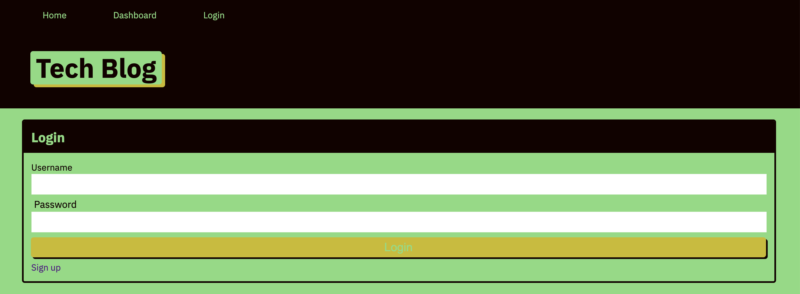
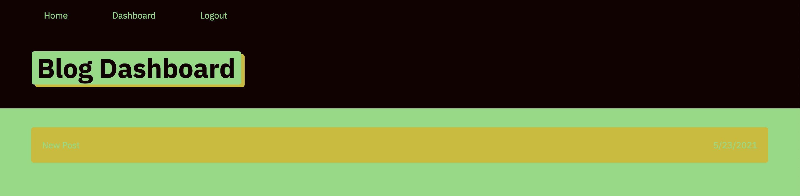

# Tech Blog
    
## Table of Contents
* [Description](#description) 
* [Installation](#installation)
* [Usage](#usage)
* [Credits](#credits)
* [License](#license)
* [Badge](#badge)
* [Questions](#questions)
    
## Description
* Web based blog for up and coming web developers
    
## Installation
* User will need to still all file directories in a a folder and launch from the main root directory of that folder.
    
## Usage
* Once installed, launch application by running the node run watch command at the command prompt.  This will access and launch the application and the database in the background.  See images below for eexamples of use.

    
## Credits
* N/A
    
## License
* Licensed by mit
    
## Badge
* 
    
## Questions
* For any questions, concerns, or additional help, please contact klucas72@hotmail.com.
